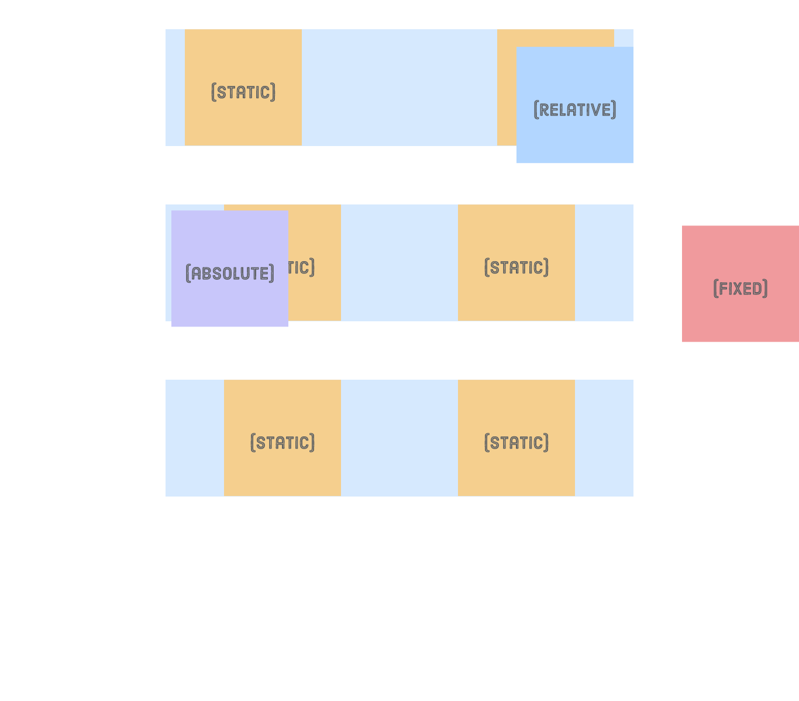

# Interneting Is Hard - Advanced Positioning

This is a solution to the [Advanced Positioning tutorial No. 9 of HTML & CSS Is Hard](https://www.internetingishard.com/html-and-css/advanced-positioning/).

## Table of contents

- [Overview](#overview)
  - [Screenshots](#screenshots)
  - [Links](#links)
- [My process](#my-process)
  - [Built with](#built-with)
  - [What I learned](#what-i-learned)
  - [Continued development](#continued-development)
  - [Useful resources](#useful-resources)
- [Author](#author)
- [Acknowledgments](#acknowledgments)

## Overview

### Screenshots

### Links

- Solution URL: [Advanced Positioning solution](https://github.com/jugglingdev/advanced-positioning)
- Live Site URL: [Advanced Positioning live site](https://jugglingdev.github.io/advanced-positioning/)

## My process

### Built with

- Semantic HTML5 markup
- CSS custom properties

### What I learned

While previous tutorials covered static positioning, this one covered relative, absolute, and fixed positioning.  We use the `position` property for these.

To offset an element from its static position, use `position: relative`, which will take values of `top`, `left`, `bottom`, or `right` as offset coordinates.

To base the position off the entire browser window and scroll with the page, use `position: absolute` with coordinates.  If you make the item's parent element `position: relative` (without specific coordinates), then the item will anchor to that element instead of the browser window.

For an element that remains in place and doesn't scroll with the page, use `position: fixed` with coordinates.  Examples of use cases for fixed positioning include navigation bars and pop-up banners.

To apply these techniques to a project, I made a menu that is fixed with a dropdown that is absolute (and anchored with relative positioning).

A best practice for menus is to code them semantically as lists for search engines.  This includes submenus.

One unique topic covered in this tutorial was the `z-index`, which assigns depth to an element.  For the menu, I used the `z-index` property to deal with the Features submenu, making sure the `Features` label didn't get covered up.  The default value is `0`, so I used `1` for the submenu and `2` for the label.

Another trick was hiding the submenu until the cursor is over `Features`.  To do this, I used the `:hover` pseudo-class for the submenu with `display: flex` to make it appear, and in a separate rule I used `display: none` to hide the submenu until the hover.

### Continued development

This tutorial took a peek at using JavaScript code with relative and absolute positioning.  The code went over my head for the time being, but it's definitely something I look forward to learning more about in the future.  For now, I got to enjoy some simple animation watching an element glide across the screen.

### Useful resources

- [MDN Cursor](https://developer.mozilla.org/en-US/docs/Web/CSS/cursor) - Change up the mouse pointer with this property!

## Author

- GitHub - [@jugglingdev](https://github.com/jugglingdev)

- freeCodeCamp - [@jugglingdev](https://www.freecodecamp.org/jugglingdev)

- Frontend Mentor - [@jugglingdev](https://www.frontendmentor.io/profile/jugglingdev)

- LinkedIn - [Kayla Paden](https://www.linkedin.com/in/kayla-marie-paden)

## Acknowledgments

Shoutout to Oliver James for his dedication to publishing and maintaining InternetingIsHard.com.  His tutorials were the first that really clicked for me.